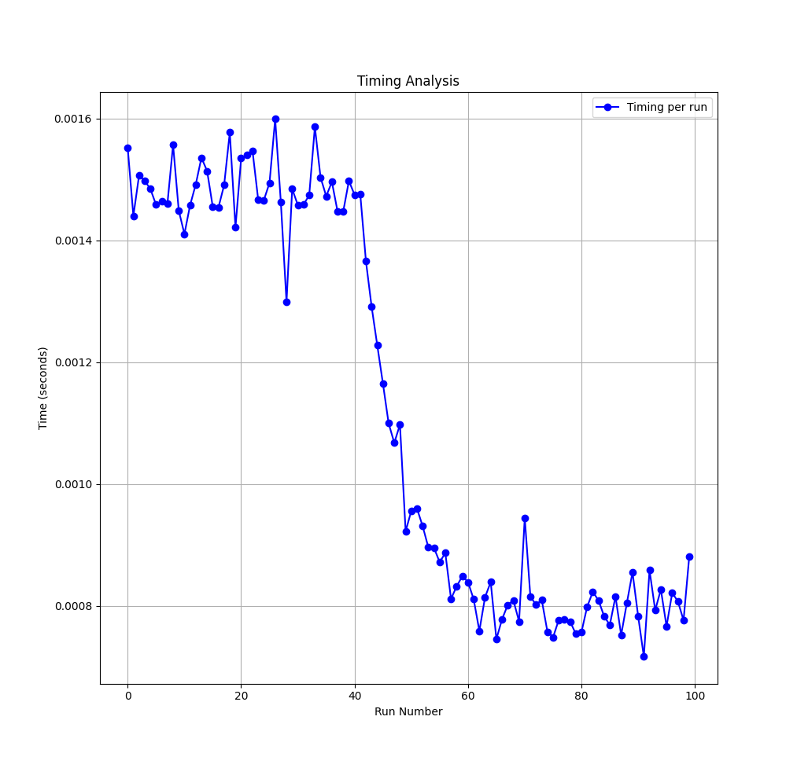

# Welcome to Neouchiha's Blog

### Feel Free to Look at my CTF_Writeups and other Projects.

[Home](https://npranav7619.github.io/)
[CTF_Writeups](https://npranav7619.github.io/CTF_Writeups)
[About Me](https://npranav7619.github.io/Aboutme)

# Cache Timing Analysis on Cryptographic operations

When it comes to hardware security, side channel analysis is one of the most widely used attacks.
To understand this lets try to understand what cache timing attacks are

In this timing attack, the attacker attempts to compromise a cryptosystem by analysing the time 
taken to execute cryptographic algorithms

Every logical operation in a computer takes time to execute, and the time can differ based on the input
and with precise measurements of the time for each operation, an attacker can work backwards to the input.
Finding secrets through timing information may be significantly easier than using cryptanalysis of known 
plaintext, ciphertext pairs.

When sensitive data is accessed, it may be cached, leading to faster subsequent accesses. 
By measuring these timing differences, you can infer which data was accessed and possibly 
reconstruct secret keys or sensitive information.


To understand this a bit more deeper..

Lets take a linux library file say libcrypto 

The OpenSSL crypto library (libcrypto) implements a wide range of cryptographic algorithms used in various 
Internet standards. The services provided by this library are used by the OpenSSL implementations of TLS 
and CMS, and they have also been used to implement many other third party products and protocols.

looking at the library functions using 'nm' command 

nm -D /usr/lib/libcrypto.so | less

-D is for dynamic

we can see that the function uses  


```

00000000000bf380 T AES_bi_ige_encrypt@@OPENSSL_3.0.0
00000000000bd0a0 T AES_cbc_encrypt@@OPENSSL_3.0.0
00000000000bef40 T AES_cfb128_encrypt@@OPENSSL_3.0.0
00000000000bef60 T AES_cfb1_encrypt@@OPENSSL_3.0.0
00000000000bef80 T AES_cfb8_encrypt@@OPENSSL_3.0.0
00000000000bcaf0 T AES_decrypt@@OPENSSL_3.0.0
00000000000befa0 T AES_ecb_encrypt@@OPENSSL_3.0.0
00000000000bc560 T AES_encrypt@@OPENSSL_3.0.0
00000000000befc0 T AES_ige_encrypt@@OPENSSL_3.0.0
00000000000bf6d0 T AES_ofb128_encrypt@@OPENSSL_3.0.0
00000000000bf6c0 T AES_options@@OPENSSL_3.0.0
00000000000bce70 T AES_set_decrypt_key@@OPENSSL_3.0.0
00000000000bcbb0 T AES_set_encrypt_key@@OPENSSL_3.0.0
00000000000bf710 T AES_unwrap_key@@OPENSSL_3.0.0
00000000000bf6f0 T AES_wrap_key@@OPENSSL_3.0.0

```


these functions for the AES Encryption / Decryption

then i wrote a small C program that uses these functions to try and figure out how these functions are being used in real time.


```
#include <openssl/aes.h>
#include <openssl/rand.h>
#include <openssl/err.h>
#include <stdio.h>
#include <string.h>
#include <time.h>

void handle_errors() {
    ERR_print_errors_fp(stderr);
    abort();
}

int aes_encrypt(const unsigned char *key, const unsigned char *iv,
                const unsigned char *plaintext, unsigned char *ciphertext) {
    AES_KEY enc_key;
    AES_set_encrypt_key(key, 128, &enc_key); // 128-bit key
    AES_cbc_encrypt(plaintext, ciphertext, strlen((char *)plaintext) + 1, &enc_key, (unsigned char *)iv, AES_ENCRYPT);
    return 0;
}

int aes_decrypt(const unsigned char *key, const unsigned char *iv,
                const unsigned char *ciphertext, unsigned char *plaintext) {
    AES_KEY dec_key;
    AES_set_decrypt_key(key, 128, &dec_key); // 128-bit key
    AES_cbc_encrypt(ciphertext, plaintext, strlen((char *)ciphertext) + 1, &dec_key, (unsigned char *)iv, AES_DECRYPT);
    return 0;
}

int main() {
    OpenSSL_add_all_algorithms();
    ERR_load_crypto_strings();

    
    unsigned char key[AES_BLOCK_SIZE]; // AES_BLOCK_SIZE is 16 bytes
    unsigned char iv[AES_BLOCK_SIZE];

    if (!RAND_bytes(key, sizeof(key)) || !RAND_bytes(iv, sizeof(iv))) {
        handle_errors();
    }

        const char *message = "Hello, AES!";
    unsigned char encrypted[128];
    unsigned char decrypted[128];

        struct timespec start, end;
    clock_gettime(CLOCK_MONOTONIC, &start);
    aes_encrypt(key, iv, (unsigned char *)message, encrypted);
    clock_gettime(CLOCK_MONOTONIC, &end);
    double encrypt_time = (end.tv_sec - start.tv_sec) + (end.tv_nsec - start.tv_nsec) / 1.0e9;
    printf("Encryption Time: %f seconds\n", encrypt_time);

   
    clock_gettime(CLOCK_MONOTONIC, &start);
    aes_decrypt(key, iv, encrypted, decrypted);
    clock_gettime(CLOCK_MONOTONIC, &end);
    double decrypt_time = (end.tv_sec - start.tv_sec) + (end.tv_nsec - start.tv_nsec) / 1.0e9;
    printf("Decryption Time: %f seconds\n", decrypt_time);

    printf("Original Message: %s\n", message);
    printf("Decrypted Message: %s\n", decrypted);

    
    EVP_cleanup();
    ERR_free_strings();

    return 0;
}
```

and once compiled using appropriate flags  
we have a working C program that uses openssl library to encrypt/decrypt

now using gdb  we set breakpoints when the function uses AES_set_decrypt_keyand try to measure the time it takes
we do this multiple times 

actually this is a python program that does the thing for us 


This Python script automates the process of measuring the time taken by a specific function, `AES_set_decrypt_key`, within a compiled executable file using `gdb`, the GNU Debugger. It does this by repeatedly running the executable 100 times, setting a breakpoint at the specified function, and then continuing the execution while measuring the time taken using Python's `time` module within the `gdb` environment. The elapsed time for each run is extracted from the `gdb` output using a regular expression. After all runs are completed, the script calculates and prints the average time taken across all successful measurements, giving insight into the function's performance.

And plotting the results we see that the time gets reduced by half as it crosses 50 mark




